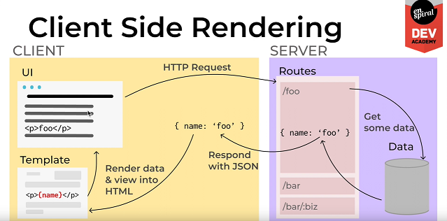

# React Introduction
## Web Architecture
 > Client Side Rendering


 

 - Client Side has a much heavier front-end and server side focusses on getting data out of the database
   - Instead of rendering into a template and sending back HTML data, the server takes the HTTP request and sends back json data.
   - The client machine then takes the json data and renders it to get html
   - Instead of having to make HTTP requests, the client side can render it's own templates and make changes to the page on the client side.
- Benefits:
  - less server resources are required to to run and maintain projects
  - client experience is much faster due to the rendering load being reduced for the server 
    - as well as clients being generally more than capable of rendering (unlike in the past)
  - We can update parts of the page that actually need to change, rather than receiving an entire html document. 

## The Virtual DOM
An exact copy of the real DOM, but it only exists in memory; we can update it faster
> virtual DOM updates in memory, so when the actual DOM changes it can use `diffing` to compare the previous virtual DOM to the updated virtual DOM and locate what specifically needs to change; speeding up the process for a better user experience


> If there is no change in the real DOM, the virtual DOM stays the same. As opposed to rendering the entire real DOM with each change.

 

## React Components
User interfaces are sets of *components*:
  - *components* are small composable areas of the view.
  - arranged in a hierarchical structure.
    - *container components* parent to *child components*
  - Components contain user interface elements in the form of JSX and data.

> Component(Named Header): 
```// Header.jsx
import React from 'react'
function Header() {
  return (
    <div>
      <h1>Header</h1>
    </div>
  )
}
export default Header
```
> Component being imported:

```// App.jsx
import React from 'react'
import Header from './Header'
function App() {
  return (
    <div>
      <Header />
    </div>
  )
}
export default App
 ```

## React Props
Data is received by Components through *Props*

```// Header.jsx
import React from 'react'
class Header extends React.Component {
  render() {
    return (
      <div>
        <h1>{this.props.text}</h1>
      </div>
    )
  }
}
export default Header
```

```// App.jsx
import React from 'react'
import Header from './Header'
class App extends React.Component {
  render() {
    return (
      <div>
        <Header text="This Page is About Cats" />
      </div>
    )
  }
}
export default App
```

## Task Runners and Bundlers 
> *Task Runners* perform tasks to prepare code for deployments
> *Bundlers* allows a number of files and bundle them into a single file for deployment
> We will use [webpack](https://webpack.js.org/) to bundle.

## ECMA Script Modules
### **CommonJS**(`module.exports` & `require`)
- Created for NodeJS
- Doesn't work in the browser

### **ESModules** (`export` & `import`)
- This is the browser-compatible equivalent of CommonJS
  - (CommonJS can use **ESModules** now, but best practice is to use Common for node and ESModules for client side)

## ESModules
- Exporting:
  - named exports: need to use the name: 
  
        export const greeting = 'Heya'
  > to import(have to destructure named exports):

        import { greeting, greet } from './hey'

  - default exports:
   
        export default function greet(name) {
          console.log(`${greeting}, ${name}!`)
        } 
  > to import:

        import greetFn from './hey'

        greetFn('everybody')

> How to import both Named and Default exports at the same time:

    import greetFn, { greeting } from './hey'


- Importing:
  - Destructuring: `import { greeting, greet } from './hey' `
         
## The Build Process
### Bundling with [Webpack](https://webpack.js.org/):
- Combines every file into a single file (bundle)
- webpack watches and re-bundles automatically when changes are made to files    
    
        building@0.0.1 webpack
        webpack --config client/webpack.config.js "--watch"
- Can debug in DevTools `Sources`


### Transpiling with [Babel](https://babeljs.io/docs/en/index.html)

## Functional Components 

### React Syntax(JSX: JS & HTML in one)
>**Functional Components:**
> Need to:
  > - `import React from 'react'`
  > -  `import ReactDOM from 'react-dom'` to specify how we will be using React, it can be used elsewhere in mobile apps etc.
  > - Connect to html with an `id`:  

 
- Tell react to get a component by using a capital and a self closing slash:
`<App />`

- `{}` to use expressions within component
- Each component must return a single parent `<> </>` 
- Some HTML properties are different
  - `class` -> `className`
  - `for` -> `htmlFor`

**Component Hierarchy:**
**React DevTools:**

## Rendering Logic 

## React State
State is data created within a React component and can be changed within a component using the useState hook

 ``` import React, { useState } from 'react'
  function Counter () {
    const [count, setCount] = useState(0)
    function handleClick () {
      setCount(count + 1)
    }
    return (
      <div>
        <h1>State FTW!</h1>
        <p>Current count is: {count}</p>
        <button onClick={handleClick}>Increase</button>
      </div>
    )
  }
  export default Counter
  ```

  ## Event Delegation

  