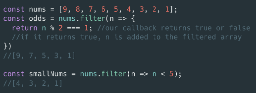

> [home](../../home.md)

# Built-in Methods - Filter()

> "The filter() method creates a new array with all elements that pass the test implemented by the provided function." - [MDN](https://developer.mozilla.org/en-US/docs/Web/JavaScript/Reference/Global_Objects/Array/filter)

Creates a new array and put things in it that meet specific requirements

### MDN Example:

    const words = ['spray', 'limit', 'elite', 'exuberant', 'destruction', 'present'];

    const result = words.filter(word => word.length > 6);

    console.log(result);
    // expected output: Array ["exuberant", "destruction", "present"]

### Example 2:
> The purpose of the following function is to take a string and filter out any iteration of the word 'buzz' (capitalised or lowercase), then return it to a new array.

    function deBee (str){
      let honey = str.split(' ');
      let result = honey.filter(words => {
        return words.toLowerCase() !== "buzz"
        });

      return result.join(' ');
    }

#### Let'`s break it down
>`honey.filter(function(words) {return words.toLowerCase() !== "buzz"})`

or:

> `honey.filter(words => {return words.toLowerCase() !== "buzz"});`

Above we can see the following:
- `honey.filter(` is selecting the variable honey and applying the filter method to it
- `(words => {})` call back function names elements `words`
- It changes all elements to lowercase(to assist with filtering, it avoids entering every possible iteration of the word)
- it filters out words that *are not* "buzz" and returns them to the new array.

### Example 3
> The purpose of this function is to return and array of names containing less that 10 characters

    function validUserNames(usernames) {
        return usernames.filter(username => {
            return username.length < 10
        })
    }
