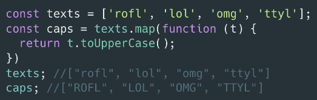

> [home](../../home.md)

# Built-in Methods - Map()

> "The `map()` method creates a new array populated with the results of calling a provided function on every element in the calling array." 

It creates a new array and puts things in it, as defined by the function. 

### Example 1:
> The purpose of this function is to take a string and capitalise the first letter of each word

    function capitalize (str) {
    let cap = str
        .split(' ')
        .map(word => { 
          return word[0].toUpperCase() + word.substring(1)
        })

      .join(' ');
      return cap;
    }

#### Lets break it down:
> `.map(function(word) {return word[0].toUpperCase() + word.substring(1)})` 

or:

> `.map(word => {word[0].toUpperCase() + word.substring(1)})`
   
Above we can see the following:
- `.map()` is how we use this method.
-  inside the parenthesis we can see the *'provided function'* 
-  the parenthesis contain a call back function
-  `(word)` represents each element 
-  for each element, return character at index 0 to the new array(created by `.map()`)in uppercase.
#### To summerise:
> call the function on each element in the original array, do something to it and put it in a new array generated by the map method.

### Example 2:
> The purpose of this variable is to take only the first name for each object in the array

    const fullNames = [{first: 'Albus', last: 'Dumbledore'}, {first: 'Harry', last: 'Potter'}, {first: 'Hermione', last: 'Granger'}, {first: 'Ron', last: 'Weasley'}, {first: 'Rubeus', last: 'Hagrid'}, {first: 'Minerva', last: 'McGonagall'}, {first: 'Severus', last: 'Snape'}];

    let firstNames = fullNames.map(function(name){
        return name.first;
    });

#### Let's break it down:
>`let firstNames = fullNames.map(function(name){return name.first})` 

or:

>`let firstNames = fullNames.map((name) => name.first)`

Above we can see the following:
- firstNames is a variable that will contain a new array created by map.
-  `fullNames.map(` is using dot notation to tell the map method where it is taking data from.
-  `(function(name))` is the call back function and will refer to elements in the array as `name`
-  `return name.first` name refers to the element being passed into map. so `name.first` is telling map to take only the data from the key-value pair `first:` to insert into the new array.

#### Result:
    [ "Albus", "Harry", "Hermione", "Ron", "Rubeus", "Minerva", "Severus" ] 

### MDN Example:

    const array1 = [1, 4, 9, 16];

    // pass a function to map
    const map1 = array1.map(x => x * 2);

    console.log(map1);
    // expected output: Array [2, 8, 18, 32]
